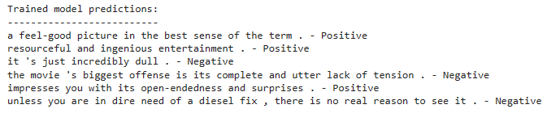

# Efficient Fine-Tuning of LLMs with LoRA for Sentiment Analysis

This repository provides an implementation of fine-tuning a Large Language Model (LLM) using **LoRA (Low-Rank Adaptation of Large Language Models)** for text classification. The model is trained on the **Stanford Sentiment Treebank (SST-2)** dataset, following insights from the article ["Fine-tuning Large Language Models (LLMs)"](https://towardsdatascience.com/fine-tuning-large-language-models-llms-23473d763b91).

LoRA enables efficient fine-tuning by **freezing the pre-trained model** and introducing **small trainable matrices** within each layer. This reduces computational overhead and enhances adaptability without modifying all parameters.

## Table of Contents
- [Installation](#installation)
- [Usage](#usage)
- [Model Overview](#model-overview)
- [Training](#training)
- [Inference](#inference)
- [References](#references)

## Installation
To set up the environment and install dependencies, run the following commands:

```bash
pip install datasets transformers peft evaluate
```

These libraries support dataset handling, model transformations, LoRA fine-tuning, and performance evaluation.

## Usage
### 1. Load the SST-2 Dataset
The SST-2 dataset, available via the Hugging Face `datasets` library, consists of movie reviews with sentiment labels. Learn more about it [here](https://huggingface.co/datasets/glue/viewer/sst2).

### 2. Define the LoRA Model
LoRA fine-tuning adapts a pre-trained language model by modifying only low-rank matrices instead of full weights. This improves efficiency while maintaining model accuracy.

### 3. Tokenize the Dataset
Tokenization is handled using the model's tokenizer, ensuring that special tokens like `[PAD]` are correctly applied.

### 4. Train the LoRA Model
Hyperparameters, such as learning rate, batch size, and training epochs, are defined within the `training_args` variable. Adjust them as needed for optimal performance.

### 5. Perform Inference
After training, the model can classify sentiments for new text inputs. The repository includes sample code to load the trained model and make predictions.

## Model Overview
This repository employs a **pre-trained transformer model** with LoRA fine-tuning for text classification. Instead of updating the entire model, LoRA optimizes adaptation performance by leveraging low-rank matrix transformations. Learn more from the [LoRA paper](https://arxiv.org/abs/2106.09685).

## Training
To fine-tune the model:
1. Install dependencies (see [Installation](#installation)).
2. Load the SST-2 dataset.
3. Configure hyperparameters.
4. Run the training script.

## Inference
After training, use the fine-tuned model for sentiment classification:
1. Load the trained model.
2. Tokenize input text.
3. Pass the tokenized text to the model.
4. Retrieve sentiment predictions (positive/negative).

## References
- [SST-2 Dataset](https://huggingface.co/datasets/glue/viewer/sst2)
- [LoRA Paper](https://arxiv.org/abs/2106.09685)

## Model Predictions
### Before Training


### After Training


---
This repository provides an efficient approach to fine-tuning LLMs using LoRA, significantly reducing computational costs while maintaining strong model performance.

